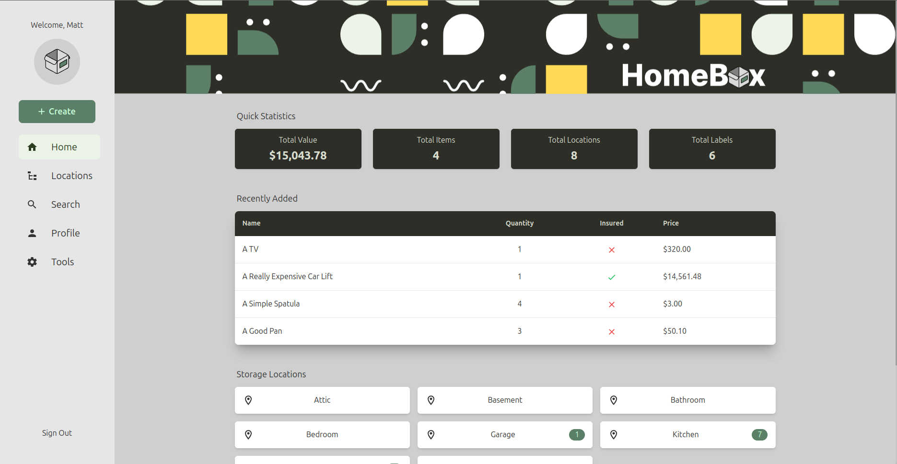

---
# https://vitepress.dev/reference/default-theme-home-page
layout: home

hero:
  name: "HomeBox"
  text: "A simple home inventory management software"
  image:
    src: /lilbox.svg
    alt: HomeBox logo
  actions:
    - theme: brand
      text: Quick Start
      link: /en/quick-start
    - theme: alt
      text: Tips and Tricks
      link: /en/tips-tricks
    - theme: alt
      text: Try It Out
      link: https://demo.homebox.software

features:
  - title: Add/Update/Delete Items
    details: You can add, update and delete your own items in inventory simply
  - title: Optional details
    details: Optional extra details like warranty information, and item identifications
  - title: CSV Import/Export
    details: Import a CSV file to quickly get started with existing information, or export to save information
  - title: Custom Report
    details: Export bill of materials, or generate QR codes for items
  - title: Custom labeling and locations
    details: Use custom labels and locations to organize items
  - title: Multi-Tenant Support
    details: All users are in a group, and can only see what's in the group. Invite family members or share an instance with friends.
---

Homebox is the inventory and organization system built for the Home User! With a focus on simplicity and ease of use, Homebox is the perfect solution for your home inventory, organization, and management needs. While developing this project, I've tried to keep the following principles in mind:

- _Simple_ - Homebox is designed to be simple and easy to use. No complicated setup or configuration required. Use either a single docker container, or deploy yourself by compiling the binary for your platform of choice.
- _Blazingly Fast_ - Homebox is written in Go, which makes it extremely fast and requires minimal resources to deploy. In general idle memory usage is less than 50MB for the whole container.
- _Portable_ - Homebox is designed to be portable and run on anywhere. We use SQLite and an embedded Web UI to make it easy to deploy, use, and backup.

## Project Status

Homebox is currently in early active development and is currently in **beta** stage. This means that the project may still be unstable and clunky. Overall, we are striving to not introduce any breaking changes and have checks in place to ensure migrations and upgrades are smooth. However, we do not guarantee that there will be no breaking changes. We will try to keep the documentation up to date as we make changes.

## Why Not Use Something Else?

There are a lot of great inventory management systems out there, but none of them _really_ fit my needs as a home user. Snipe-IT is a fantastic product that has so many robust features and management options which makes it easy to become overwhelmed and confused. I wanted something that was simple and easy to use that didn't require a lot of cognitive overhead to manage. I primarily built this to organize my IOT devices and save my warranty and documentation information in a central, searchable location.

### Spreadsheet

That's a fair point. If your needs can be fulfilled by a Spreadsheet, I'd suggest using that instead. I've found spreadsheets get pretty unwieldy when you have a lot of data, and it's hard to keep track of what's where. I also wanted to be able to search and filter my data in a more robust way than a spreadsheet can provide. I also wanted to leave the door open for more advanced features in the future like maintenance logs, moving label generators, and more.

### Snipe-It?

Snipe-It is the gold standard for IT management. If your use-case is to manage consumables and IT physical infrastructure, I highly suggest you look at Snipe-It over Homebox, it's just more purpose built for that use case. Homebox is, in contrast, purpose built for the home user, which means that we try to focus on keeping things simple and easy to use. Lowering the friction for creating items and managing them is a key goal of Homebox which means you lose out on some of the more advanced features. In most cases, this is a good trade-off.
